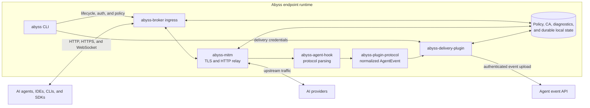

# Abyss

## About Abyss

Abyss is an open-source endpoint runtime for observing and controlling AI agent
network traffic. It provides an explicit HTTP/HTTPS proxy, TLS interception,
AI agent and provider protocol parsing, local capture policy, normalized audit
events, pluggable event delivery, and Rust, TypeScript, and Python SDKs.

The shared runtime is implemented in Rust. Platform integrations feed traffic
into stable broker ingress contracts while policy, interception, parsing, and
event production remain platform independent.

## Quick Start

The local environment supports Linux x86_64 and macOS ARM64 without Docker. It
requires Git, Rust/Cargo, OpenSSL, curl, Node.js 22 or newer, and npm 10 or
newer. Clone the repository, then run its installer to build the Abyss CLI and
SQLite+FTS backend, install the dashboard package, and start the complete
environment:

```bash
git clone https://github.com/lexmount/abyss-rs.git
cd abyss-rs
bash scripts/install-local.sh
```

The installer keeps all services on IPv4 loopback, stores the SQLite database
and private bearer files under `~/.abyss/local`, automatically selects available
backend and dashboard ports, and prints any PATH update needed by the current
shell. `abyss status` and `abyss proxy start` print the selected dashboard URL.
Run an agent through Abyss after installation:

```bash
abyss-local status
abyss run -- codex
```

Manage the environment without reinstalling it:

```bash
abyss-local stop
abyss-local start
abyss-local logs
```

The installer refuses to replace an unrelated existing
`~/.abyss/product-config.json`; set `ABYSS_HOME` to another absolute directory
when the machine already has a different deployment. Linux installation uses
the existing systemd broker integration and may request `sudo`.

### Build the CLI only

To build only the endpoint CLI and its runtime processes from source:

```bash
git clone https://github.com/lexmount/abyss-rs.git
cd abyss-rs
cargo build --release --locked \
  --package abyss-cli \
  --package abyss-broker \
  --package abyss-delivery-plugin
export PATH="$PWD/target/release:$PATH"
```

The CLI requires a deployment-supplied `product-config.json`. The local
installer creates a profile that delivers events to its authenticated backend.
Other distributions can provide their own delivery destination and
authentication mode; `managed_bearer` deployments also require a control plane
and `abyss login`.

Run another AI agent without changing the parent shell:

```bash
abyss run -- claude
```

Alternatively, export the proxy variables into the current shell:

```bash
eval "$(abyss proxy env)"
```

Common operational commands are:

```bash
abyss status
abyss diagnostics
abyss config context off
abyss config harness enable codex
abyss log dump
abyss proxy stop
abyss logout
```

See [Endpoint configuration](docs/configuration.md) for the complete runtime and
deployment configuration boundary.

## Architecture



Explicit-proxy clients connect directly to `abyss-broker`. External macOS and
Windows platform adapters can use the same broker ingress contracts to attach
process identity and transparently redirect traffic. The broker and shared Rust
crates do not depend on those platform implementations.

## License

Abyss is licensed under the [GNU General Public License, version 3](LICENSE).
