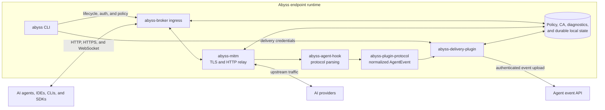

# Abyss

## About Abyss

Abyss is an open-source endpoint runtime for observing and controlling AI agent
network traffic. It provides an explicit HTTP/HTTPS proxy, TLS interception,
AI agent and provider protocol parsing, local capture policy, normalized audit
events, pluggable event delivery, and Rust, TypeScript, and Python SDKs.

The shared runtime is implemented in Rust. Platform integrations feed traffic
into stable broker ingress contracts while policy, interception, parsing, and
event production remain platform independent.

## Quick Start

The Abyss CLI currently supports Linux x86_64 and macOS ARM64. Build the CLI and
its runtime processes from source:

```bash
git clone https://github.com/lexmount/abyss-rs.git
cd abyss
cargo build --release --locked \
  --package abyss-cli \
  --package abyss-broker \
  --package abyss-delivery-plugin
export PATH="$PWD/target/release:$PATH"
```

The CLI seeds its public broker and runtime-policy defaults automatically.
Create `$ABYSS_HOME/product-config.json` with an event-delivery endpoint. A
deployment that accepts events without authentication does not need an SSO or
control-plane configuration:

```bash
export ABYSS_HOME="$PWD/.abyss"
mkdir -p "$ABYSS_HOME"
```

```json
{
  "schema_version": 1,
  "product": {
    "kind": "cli"
  },
  "delivery_worker": {
    "delivery": {
      "endpoint": "https://events.example.com/v1/agent-usage/events"
    },
    "authentication": {
      "mode": "none"
    }
  }
}
```

Start the local proxy:

```bash
abyss proxy start
```

When a distribution selects another authentication mode, it must also provide
`product.control_plane`; run `abyss login` before starting the proxy in that
configuration.

Run an AI agent through Abyss without changing the parent shell:

```bash
abyss run -- codex
```

Alternatively, export the proxy variables into the current shell:

```bash
eval "$(abyss proxy env)"
```

Common operational commands are:

```bash
abyss status
abyss diagnostics
abyss config context off
abyss config harness enable codex
abyss log dump
abyss proxy stop
abyss logout
```

See [Endpoint configuration](docs/configuration.md) for the complete runtime and
deployment configuration boundary.

## Architecture



Explicit-proxy clients connect directly to `abyss-broker`. External macOS and
Windows platform adapters can use the same broker ingress contracts to attach
process identity and transparently redirect traffic. The broker and shared Rust
crates do not depend on those platform implementations.

## License

Abyss is licensed under the [GNU General Public License, version 3](LICENSE).
