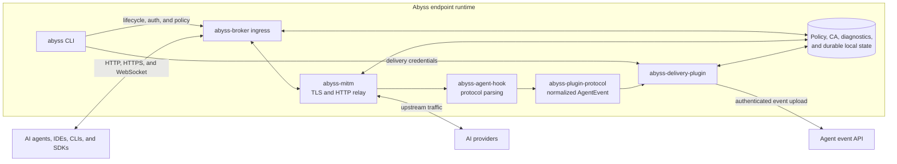

# Abyss

## About Abyss

Abyss is an open-source endpoint runtime for observing and controlling AI agent
network traffic. It provides an explicit HTTP/HTTPS proxy, TLS interception,
AI agent and provider protocol parsing, local capture policy, normalized audit
events, pluggable event delivery, and Rust, TypeScript, and Python SDKs.

The shared runtime is implemented in Rust. Platform integrations feed traffic
into stable broker ingress contracts while policy, interception, parsing, and
event production remain platform independent.

## Quick Start

The local environment supports Linux x86_64 and macOS ARM64 without Docker.
Clone the repository and build the CLI runtime from source:

```bash
git clone https://github.com/lexmount/abyss-rs.git
cd abyss-rs
cargo build --release --locked \
  --package abyss-cli \
  --package abyss-broker \
  --package abyss-delivery-plugin
export PATH="$PWD/target/release:$PATH"
```

Linux additionally requires the broker systemd integration described in
[`platform/linux/README.md`](platform/linux/README.md). With Node.js 22 or newer
and npm 10 or newer installed, deploy the SQLite+FTS backend and dashboard:

```bash
abyss deploy-local start
```

The first start downloads the checksummed native backend from the public
`lexmount/abyss-backend` GitHub Release and installs the pinned public dashboard
package below the private Abyss state directory. Neither component is added to
`PATH`; `abyss` remains the only management command.

The CLI keeps all services on IPv4 loopback and stores downloaded runtimes, the
SQLite database, logs, and private bearer files under
`~/Library/Application Support/Abyss/cli/local` on macOS or `~/.abyss/local` on
Linux. It automatically selects and persists available backend and dashboard
ports. `abyss status` and `abyss proxy start` also print the selected dashboard
URL. Inspect the complete local environment and run an agent through it:

```bash
abyss deploy-local status
abyss run -- codex
```

Manage the environment without reinstalling it:

```bash
abyss deploy-local stop
abyss deploy-local start
```

`deploy-local` refuses to replace an unrelated existing `product-config.json`
in the platform state directory; set `ABYSS_HOME` to another absolute directory
when the machine already has a different deployment. Linux proxy startup uses
the existing systemd broker integration; CA trust changes may request `sudo`.

The CLI requires a deployment-supplied `product-config.json` for proxy and agent
commands. `abyss deploy-local start` creates a local profile that delivers
events to its authenticated backend. Other distributions can provide their own
delivery destination and authentication mode; `managed_bearer` deployments
also require a control plane and `abyss login`.

Run another AI agent without changing the parent shell:

```bash
abyss run -- claude
```

Alternatively, export the proxy variables into the current shell:

```bash
eval "$(abyss proxy env)"
```

Common operational commands are:

```bash
abyss status
abyss diagnostics
abyss config context off
abyss config harness enable codex
abyss log dump
abyss proxy stop
abyss logout
```

See [Endpoint configuration](docs/configuration.md) for the complete runtime and
deployment configuration boundary.

## Architecture



Explicit-proxy clients connect directly to `abyss-broker`. External macOS and
Windows platform adapters can use the same broker ingress contracts to attach
process identity and transparently redirect traffic. The broker and shared Rust
crates do not depend on those platform implementations.

## License

Abyss is licensed under the [GNU General Public License, version 3](LICENSE).
